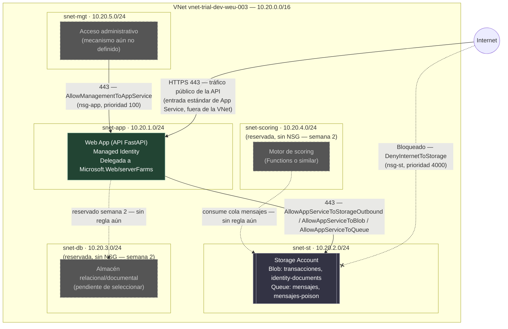

# Diagrama de red

Entregable 12. Persona 3. Subredes, rangos, componentes actuales y
previstos, y reglas de tráfico, tal como los declara
`infra/bicep/modules/network.bicep`. La justificación operativa de cada
regla está en `docs/tabla-reglas-trafico.md` (entregable 13); este
documento es la vista visual.

## 1. Topología

## 2. Rangos de direcciones

| Subred | CIDR | Hosts utilizables | Componente actual | Componente previsto |
|---|---|---|---|---|
| `snet-app` | 10.20.1.0/24 | 251 | Web App (VNet Integration regional) | Sin cambio |
| `snet-st` | 10.20.2.0/24 | 251 | Storage Account (Service Endpoint) | Sin cambio |
| `snet-db` | 10.20.3.0/24 | 251 | — (reservada) | Almacén relacional/documental (semana 2) |
| `snet-scoring` | 10.20.4.0/24 | 251 | — (reservada) | Motor de scoring (semana 2) |
| `snet-mgt` | 10.20.5.0/24 | 251 | — (reservada) | Acceso administrativo (mecanismo por definir) |

El bloque `10.20.0.0/16` reserva 65.536 direcciones; las 5 subredes /24
usan 1.280 en total — margen amplio para el escalado de semana 3 (más
instancias de scoring, subredes adicionales) sin tener que rediseñar el
espacio de direcciones.

**Tamaño mínimo de `snet-app`:** la integración regional de VNet de App
Service requiere un mínimo de `/27` (32 direcciones, de las cuales Azure
reserva algunas). `snet-app` usa `/24` (251 direcciones utilizables) —
muy por encima del mínimo, con margen para escalar instancias del plan en
semana 3.

## 3. Aislamiento de la capa de datos

Camino permitido: `snet-app → snet-st` (443, reglas `AllowAppServiceTo*`
en `nsg-st`). Camino bloqueado: `Internet → snet-st`
(`DenyInternetToStorage`, prioridad 4000) — más el `networkAcls.defaultAction:
Deny` de la propia Storage Account (`storage.bicep:26`), que es la capa de
aislamiento adicional a nivel de recurso, no solo de red. Evidencia de
ambos bloqueos verificada en `docs/prueba-aislamiento-red.md`.

## 4. Qué falta para que el diagrama esté completo

- Reglas de tráfico específicas para `snet-db` y `snet-scoring` — no
  existen todavía porque esos componentes no se han seleccionado/
  desplegado (fuera de alcance de la semana 1, sección 1).
- Mecanismo de acceso a `snet-mgt` (VPN, Bastion, jump box) — no definido;
  hoy la subred existe sin forma documentada de alcanzarla.